<div align="center">

# ⚡ `shreena88@github:~$`



<br/>

```bash
shreena88@github:~$ whoami
```

<table>
  <tr>
    <td width="50%" align="center" valign="top">
      
    </td>
    <td width="50%" align="center" valign="top">
      
    </td>
  </tr>
</table>

<br/>

```bash
shreena88@github:~$ tree projects/
```

```text
projects/
├── 🤖 Agentic workflow automation
├── 🏥 Medical Report Analyzer
├── 📰 Briefly
└── 📧 Datasense-AI
```

<br/>


</div>
